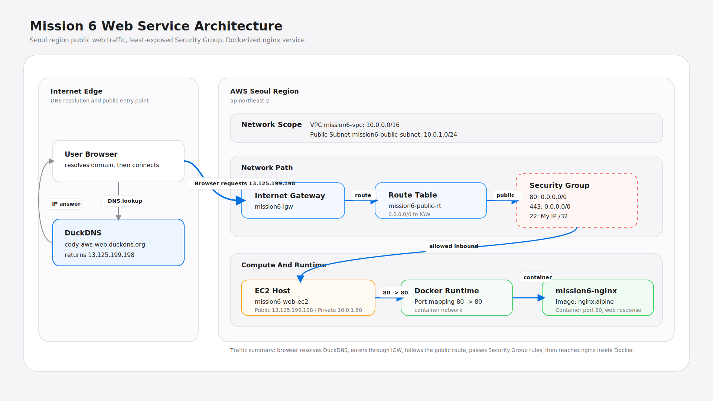
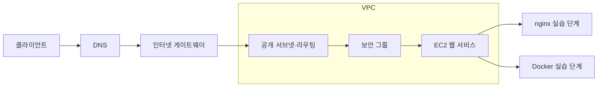

# 보안 클라우드 서비스 인프라 실습

## 프로젝트 소개

AWS VPC와 공개 서브넷에 EC2 웹 서버를 구성하고 SSH 접근 제한, DNS, HTTPS, Docker 실행, 리소스 정리를 검증한 인프라 실습 기록입니다. 구성도·절차·오류 분석·스크린샷을 관리합니다.

## 핵심 특징

- VPC·서브넷·라우팅·인터넷 게이트웨이의 연결 구조
- HTTP·HTTPS 공개 포트와 관리자 IP로 제한한 SSH
- IAM 권한과 네트워크 접근 제어의 역할 구분
- nginx·DNS·인증서·Docker 실행 증빙
- 과금 리소스 정리 순서와 삭제 증빙

## 아키텍처

`클라이언트 → DNS → 인터넷 게이트웨이 → 공개 서브넷·라우팅 → 보안 그룹 → EC2 웹 서비스` 흐름입니다. 직접 설치한 nginx와 Docker 실행은 실습 단계별 기록으로 구분합니다.



| 경로 | 역할 |
| --- | --- |
| `docs/architecture.svg`, `architecture.png` | 원본 구성도와 표시용 이미지 |
| `docs/deployment-record.md` | 기존 환경·배포·확인 기록 |
| `docs/reproduction.md` | 새 실습 환경의 준비·확인 절차 |
| `docs/troubleshooting.md` | SSH 접속 문제 분석 |
| `docs/cleanup-checklist.md` | 리소스 정리 기준 |
| `screenshots/` | 기존 단계별 검증 증빙 |



## 재현 범위

이 레포는 수동 구성 실습의 기록입니다. Terraform·CloudFormation 코드나 자동 배포 스크립트는 포함하지 않습니다. 기존 클라우드 리소스는 실습 후 삭제되었으므로 기록에 있는 IP·도메인은 현재 서비스 주소로 사용하지 않습니다.

AWS 계정과 실습 권한, SSH 클라이언트, 자신의 키페어·관리자 IP·DNS가 필요합니다. 새 환경에서는 [재현 안내](docs/reproduction.md)를 따라 자신의 리소스 값을 사용합니다. 과거 환경 값과 화면은 [배포 기록](docs/deployment-record.md)에 보존합니다.

## 검증

```bash
make check
```

로컬 검증에는 Python 3.10 이상과 Make를 사용합니다. 문서 링크와 파일 문법만 확인하며 AWS 리소스를 생성·변경하거나 과거 서버에 접속하지 않습니다. 실제 네트워크·인증서·서비스 검증은 새 실습 환경에서 별도로 수행합니다.

## 운영 기록

- [배포·검증 기록](docs/deployment-record.md)
- [문제 해결 기록](docs/troubleshooting.md)
- [정리 체크리스트](docs/cleanup-checklist.md)
